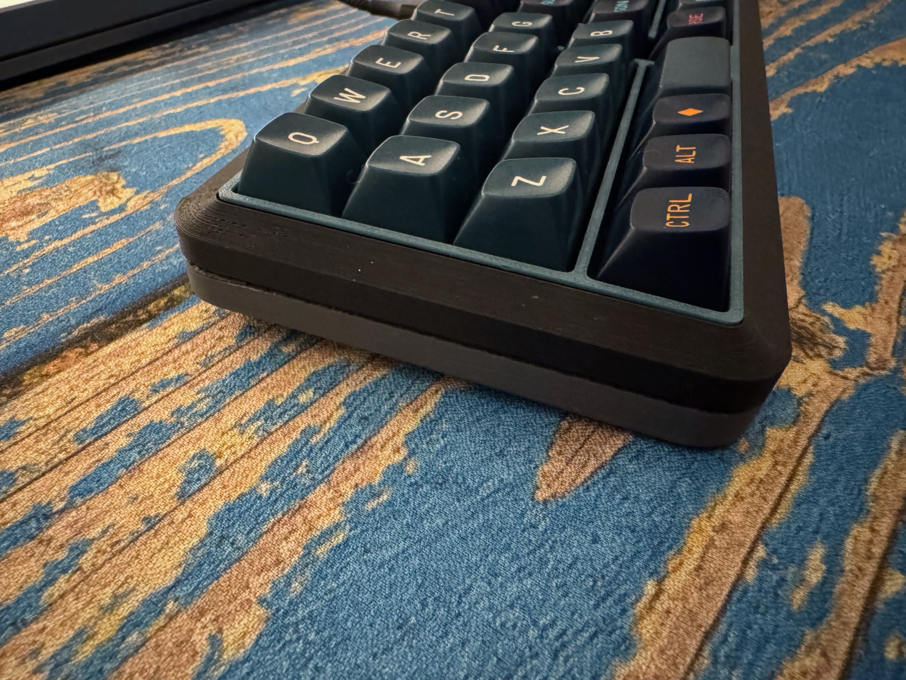
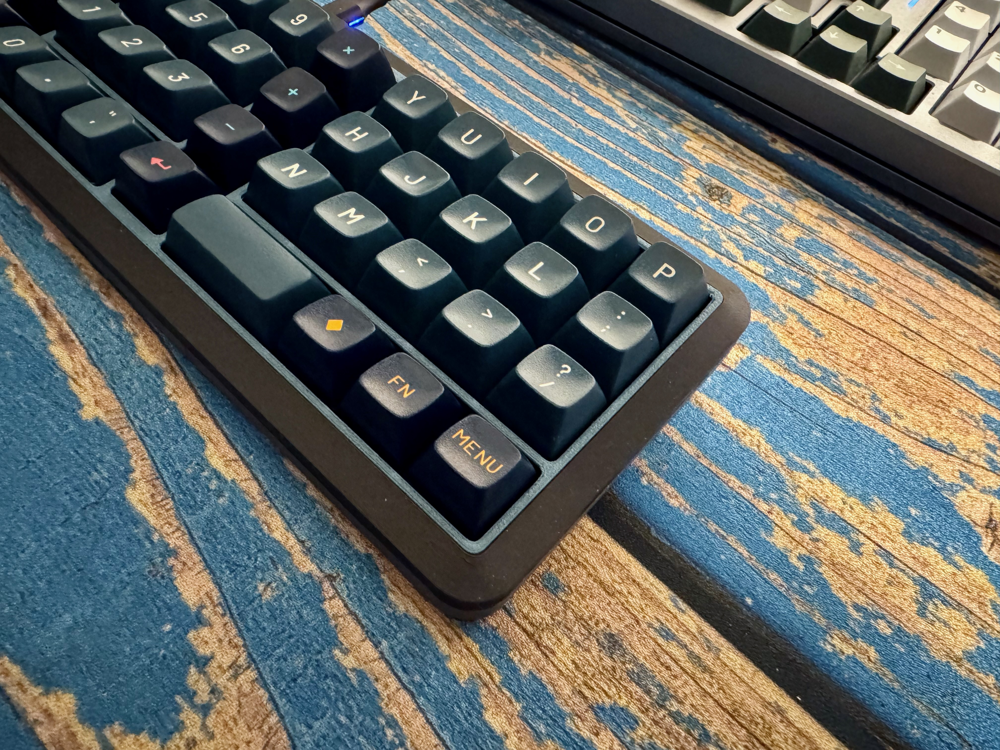
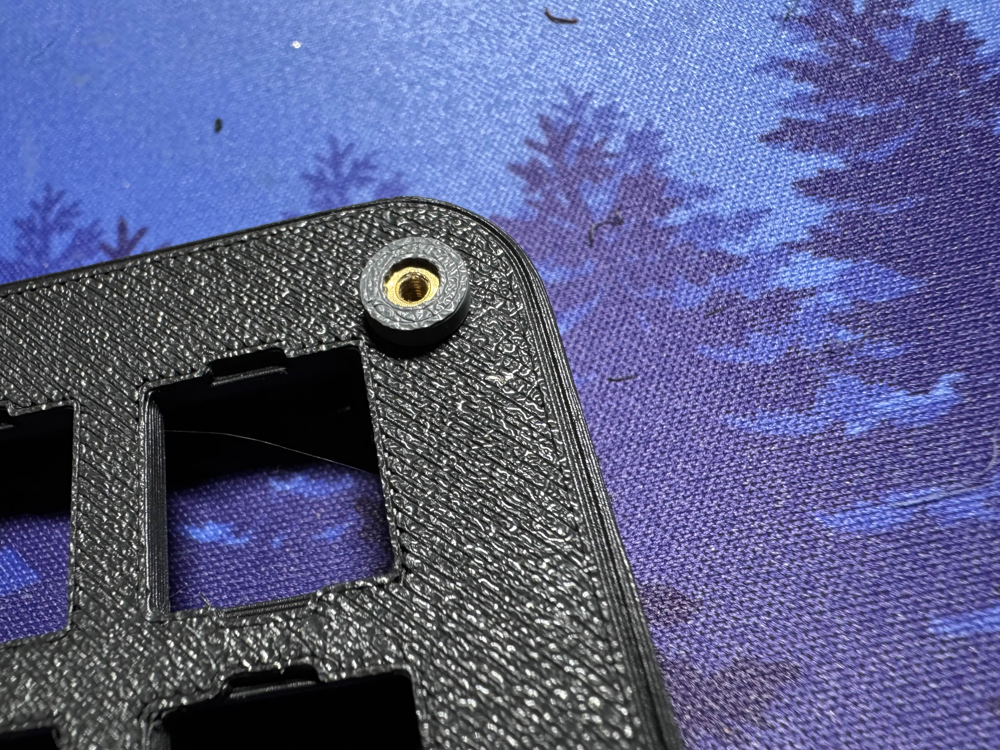

### ChonkyKong

60 key orthogonal keyboard with numpad and makro rows

## Fork

This fork adds a version of the case that is printable with FDM and has cutouts for Stabs. There is also an insert for printing in TPU for a better sound (instead of foam).

The little ring spacers can be connected to the top with the heat inserts.

On the top is an accent piece, to print in a color fitting to your keycaps. It is just glued in place. You can also include it in the print of the top part, so it becomes one piece, if you dont want to have it. 

Original

## Features

- Hotswap sockets
- onboard rp2040
- production files for pcba
- case files are supplied (stl, dxf, as well as the freecad files)
- QMK with vial support
- completely open source, permissive license ([CERN-OHL-P](https://cern-ohl.web.cern.ch/home))

- bottom rows supported:
  - alpha thumbs
    - 1u 1u 1u
    - 2u 1u
    - 3u
  - numpad thumbs
    - 1u 1u 1u
    - 2u 1u
    - 1u 2u
  - makro cols
    - 1u 1u 1u 1u
    - 2u 1u 1u
    - 1u 1u 2u
    - 1u 2u 1u
    - 2u 2u

## Want one?

All production files you need to build your own board can be found here: [pcb](./prod/pcb) / [case](./prod/case).

Parts needed beside the assembled pcbs:

- up to 60 hotswap sockets ( mx or choc)

- up to 60 of your favourite switches (mx or choc)

- 8 m2 heat inserts

- 8 m2 screws

### firmware
The first time the pcb is plugged in, the bootloader will provide a drive to upload the firmware file. 
You may either build the firmware yourself or use the provided vial firmware files [here](./firmware). You may use VIAL ([download](https://get.vial.today/) to program your board after that, without need to build a new firmware.

### the rest

Everything in this repository is free to use however you might see fit. If you want to support me and my projects, please consider linking back to this repository if you build/change/use anything.

If you would like to send me a tip, you could do it [here](https://ko-fi.com/weteor) (Please don't feel like you have to).

